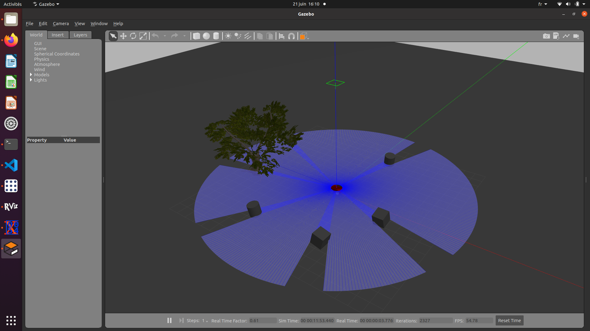

# 4-wheeled robot with ackermann steering simulation

## Installation

```bash
sudo apt-get install ros-noetic-rqt ros-noetic-rqt-common-plugins ros-noetic-gazebo-ros-pkgs ros-noetic-gazebo-msgs ros-noetic-gazebo-plugins ros-noetic-gazebo-ros-control ros-noetic-teleop-twist-keyboard ros-noetic-ros-controllers
cd catkin_ws/src # In catkin workspace
git clone XXX
cd ..
catkin_make
```

## Usage

```bash
# In catkin_ws/src
cd robot_model_pkg
source devel/setup.bash
roslaunch robot_model_pkg main.launch
```

The gazebo simulator launches. The robot is visible in the center of the map surrounded by several obstacles. The simulation is initially paused.
In addition, an xterm window opens to control the robot steering. 
Current velocity (x, m/s) and direction (theta_z, rad) commands are shown in the terminal window.

## Filesystem description

- config folder: yaml files for gazebo simulation.
- launch folder: roslaunch files.
- scr folder: cpp ros node files.
- urdf folder: Robot model description files.
- worlds: gazebo simulation worlds.

## Robot model description

The teleop-twist-keyboard node sends velocity and direction command on the /robot_command topic (remapped from /cmd_vel).
Each front wheel joint is linked to the robot chassis joint through an "angle joint" to control their direction.
the robot controller node (src/robot_controller.cpp) subscribes to the /robot_command topic and sends the linear.x data to the front wheels VelocityJointInterface controllers (wheel3_velocity_controller and wheel4_velocity_controller) and the angular.z data to the PositionJointInterface of the angle joints (wheel3_angle_controller and wheel4_angle_controller).


## Troubleshooting

If gazebo doesn't launch, try the following:

```bash
killall gzserver
killall gzclient
```

## TODO

- Basic URDF 4 wheeled robot
- Add Ackermann model controller node using stdin to steer
- Steer using the teleop-twist-keyboard node
- Remap /cmd_vel control topic to /robot_command
- Tune PID values in 0g world
- Add LiDaR plugin
- Create world with obstacles
- cleanup and update readme file
- Create github page

## Issues

- Initial drift of the robot when the simulation is launched.
- PID values cannot be tuned at the moment as the controllers state/process_values are not being published. To solve this, a custom gazebo controller plugin must be created, see https://classic.gazebosim.org/tutorials?cat=guided_i&tut=guided_i5.
- Laser scan points are visible in gazebo (see picture below) but not broadcasted back to Rviz (the /scan topic is empty) despite the laser_frame being correctly linked to the robot chassis and its tf transform being published.

